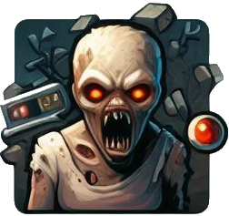

# Cruzada
Início de um jogo 3D em GODOT 4

 
Este é um princípio de um jogo para GODOT 4, que tem como ideia você movimentar um heroi pela tela utilizando o mouse e tendo como ataques as teclas QWERT

### Ele possui:
* Um personagem dentre os 3 que podem ser escolhido
* dois mapas. Uma cidade de um mapa que é utilizado para completar missoes etc (atenção. não existe o modo de missão ainda)
* Dois NPC´s que fazem a troca de skills e criação de produtos
* um banco de dados em SQLLite (devido a problemas para subir ele, deve-se ser baixado do godot em ASSETSLIB, sort (name A-Z). Baixe Godot SQLLite. As rotinas já se encontram no sistema, na pasta comum\database.gd
  
Alguns NPC´s que interagem com você.
* SKILL
* Forja - Apenas o arqueiro tem itens para serem forjados

(<a href="#readme-top">back to top</a>)

### Café
* Se quiser me pagar um cafezinho, tô dentro viu: PIX: marreis.a.reis@gmail.com

### Feito com
* [[Godot][Godotengine.org][Godot-url]
