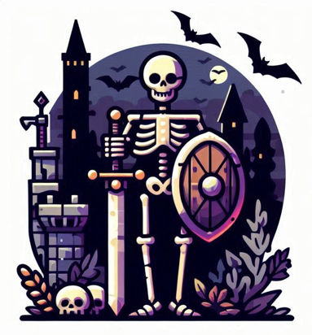

# arpg - sem nome
Início de um jogo 3D em GODOT 4.4

Este é um princípio de um jogo para GODOT 4. (MPV)

### Ele possui:
* Possui 30 players que, ao ser criado, serão apenas 15 e todos randomicamentes. Possuem foto, nome, sexo e classe
* Uma cidade que você poderá executar diversas atividades nela, a princípio somente trocar de player, mas podendo ter mais adicionamentos ao seu dispor
* Um mapa que, existem duas cores que você marca para indicar ponto de mobs e a outra cor para indicar as cidades.
* As cidades são criadas randomicamentes, juntamente com os pontos de mobs, criando também as quantidades de vezes que poderemos enfrentar este campo
* Possui um boss, mas voce poderá criar diversos mobs e instanciar eles automaticamente

### Extras
* Possui um addon de SQLite e tem uma classe global comum chamada Database onde você poderá fazer 3 acesso, 
	1. ler um.:Ex. Database.select("campo")
	2. ler todos (like):Ex. Database.select("campo",true)
	3. salvar dados:Ex. Database.update("campo",JSON.stringify(dados))
utilize a ferramente baixada da web db browser-sqlite (https://sqlitebrowser.org/) para abrir o arquivo res:// ou user://  procure o endereco do seu 
projeto no output do godot uma linha parecida com esta:

<strong>Opened database successfully (C:/Users/Windows 10/AppData/Roaming/Godot/app_userdata/arpg/repositorio.db)</strong>

### NPC´s:
* a taverna para alterar seus players

### Observação:
Devido não ter conseguido importar a pasta addons\godot-sqlite, terá que baixar da lib do godot

(<a href="#readme-top">back to top</a>)

### Café
* Se quiser me pagar um cafezinho, tô dentro viu: PIX: marreis.a.reis@gmail.com

### Feito com
* [[Godot][Godotengine.org][Godot-url]